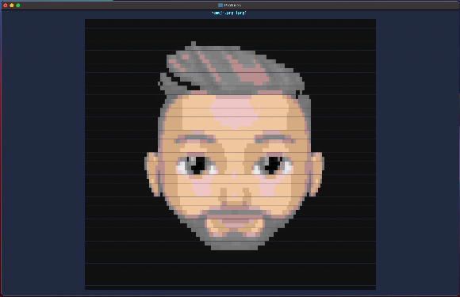

# termage


[](https://github.com/spenserblack/termage/actions/workflows/ci.yml)
[](https://goreportcard.com/report/github.com/spenserblack/termage)
[](https://codecov.io/gh/spenserblack/termage)

[][latest-release]

Browse images in the terminal *with support for animated GIFs :tada:*

## Usage Examples

### PNG image



### Animated GIF


## Pre-built Binaries

Pre-built binaries can be downloaded from the [latest release][latest-release].

## Installation From Source

### Preferred Method

This method is preferred because it will set the most accurate version info that will be printed
when using the `--version` argument.

#### Unix

```shell
curl https://raw.githubusercontent.com/spenserblack/termage/HEAD/install.sh | sh
```

#### PowerShell

```powershell
Invoke-WebRequest "https://raw.githubusercontent.com/spenserblack/termage/HEAD/install.ps1" | Invoke-Expression
```

### Other Methods

```sh
go get -u github.com/spenserblack/termage
```
```sh
go install github.com/spenserblack/termage@latest
```

## Usage

### Help

```sh
termage --help
```

### Browse all images in a directory

#### Starting from first image in directory

```sh
termage path/to/dir/
```

#### Starting from a specific image

```sh
termage path/to/dir/image
```

### Browse a specific subset of images

```sh
termage path/to/image1 path/to/image2 # ...
```

## Controls

- `n`: Next image
- `N`: Previous image
- `z`: Increase zoom by 10 percentiles
- `Z`: Decrease zoom by 10 percentiles
- `f`: Fit to screen
- `h`: Scroll left one pixel
- `H`: Scroll left 10%
- `j`: Scroll down one pixel
- `J`: Scroll down 10%
- `k`: Scroll up one pixel
- `K`: Scroll up 10%
- `l`: Scroll right one pixel
- `L`: Scroll right 10%
- `Esc`: Exit application

## Supported Formats

- PNG
- JPEG
- GIF

[latest-release]: https://github.com/spenserblack/termage/releases/latest
